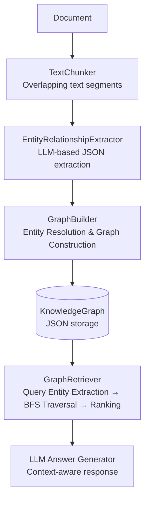

# Tiny-Graph-RAG

A lightweight Graph RAG framework that builds knowledge graphs from documents and answers questions through explicit graph traversal — no vector DB, no black-box embeddings.

Instead of semantic similarity search, it leverages structured entity connections (BFS traversal + heuristic ranking) for transparent, traceable knowledge retrieval.

---

## How It Works

The system runs in two phases: **Graph Building** (offline) and **Query Answering** (online).

### Phase 1 — Build

```
Document
  └─► TextChunker          overlapping text segments (configurable size & overlap)
        └─► EntityRelationshipExtractor   LLM extracts entities + relationships as JSON
              └─► GraphBuilder            deduplicates & merges into a KnowledgeGraph
                    └─► KnowledgeGraph    persisted as a plain JSON file
```

### Phase 2 — Query

```
User Query
  └─► Entity Extraction    LLM identifies which entities the query mentions
        └─► Anchor Matching    exact + fuzzy lookup against the graph
              └─► BFS Expansion   hop N steps outward to collect a subgraph
                    └─► Heuristic Ranking   score & filter to Top-K relevant nodes
                          └─► LLM Answer Generator   context-aware response
```

> **Why graphs instead of vectors?** Every retrieved fact traces back to an explicit entity-relationship path. You can inspect exactly which nodes and edges informed the answer.

---

## Architecture



### Module Overview

| Module | Responsibility | Key Classes |
| :--- | :--- | :--- |
| `chunking/` | Split documents into overlapping segments | `TextChunker`, `Chunk` |
| `extraction/` | LLM-powered entity & relationship extraction | `EntityRelationshipExtractor`, `ExtractionResult` |
| `graph/` | Graph construction, entity resolution, JSON storage | `GraphBuilder`, `KnowledgeGraph`, `Entity`, `Relationship` |
| `retrieval/` | Query entity extraction, BFS traversal, ranking | `GraphRetriever`, `GraphTraversal`, `SubgraphRanker` |
| `llm/` | OpenAI API client & prompt templates | `OpenAIClient` |
| `evaluation/` | Retrieval quality measurement | `EvaluationRunner`, `EvalMetrics` |
| `visualization/` | Interactive graph rendering via Pyvis | `PyVisVisualizer` |

### Entity Resolution

After extraction, entities with different surface forms that refer to the same real-world object (e.g. aliases, typos, pronouns) are merged into a single canonical node. This keeps the graph dense and consistent.

See [Entity Resolution Guide](docs/entity-resolution.md) for details.

---

## Features

| Feature | Description |
| :--- | :--- |
| **Lightweight Storage** | Knowledge graphs stored as plain JSON — no graph DB required |
| **LLM-Powered Extraction** | Extracts entities, types, descriptions, and relationships from unstructured text |
| **Advanced Retrieval** | BFS subgraph expansion + heuristic ranking to surface relevant context |
| **Entity Resolution** | LLM-based deduplication of aliases, typos, and alternate names |
| **Evaluation Pipeline** | Measures retrieval quality with Precision, Recall, MRR, nDCG, latency, and cost |
| **Visualization** | Interactive HTML graph via Pyvis |
| **OpenAI-Compatible** | Works with any OpenAI-compatible endpoint (Azure, Ollama, vLLM, etc.) |

---

## Getting Started

**Requirements:** Python 3.13+, OpenAI API Key

```bash
uv sync
export OPENAI_API_KEY="your-api-key"
```

Model, chunking parameters, and storage paths are configured in `config.yaml`.

---

## CLI Usage

### 1. Build a Knowledge Graph

Process a document and save the resulting graph:

```bash
uv run python main.py process "data/novels/kim-camellia.txt" -o "kim-camellia-KG.json"
```

### 2. Query

Ask a question against an existing graph:

```bash
uv run python main.py query "Explain the relationship between Jeom-soon and the rooster." \
  -g "kim-camellia-KG.json"
```

### 3. Interactive Mode

Start a REPL-style session for multi-turn queries:

```bash
uv run python main.py interactive -g "kim-camellia-KG.json"
```

### 4. Graph Stats

Inspect entity/relationship counts and type distributions:

```bash
uv run python main.py stats -g "kim-camellia-KG.json"
```

### 5. Streamlit Web UI

```bash
uv run python main.py app
```

| Graph View | Query View |
| :---: | :---: |
|  |  |

---

## Evaluation

Quantitatively measures retrieval quality. The output JSON includes per-example metrics and an overall summary (latency, token usage, estimated cost).

```bash
uv run python main.py eval \
  --dataset "kim-camellia-eval.jsonl" \
  -g "kim-camellia-KG.json" \
  -o "kim-camellia-eval-results.json"
```

Key options:

| Flag | Default | Description |
| :--- | :---: | :--- |
| `--top-k` | 5 | Seed entities per query |
| `--hops` | 2 | BFS traversal depth |
| `--skip-generation` | off | Retrieval-only evaluation (no LLM answer) |
| `--price-per-1k-input` | 0.00015 | USD per 1K input tokens |
| `--price-per-1k-output` | 0.0006 | USD per 1K output tokens |

For dataset format, see [docs/evaluation.md](docs/evaluation.md).

### Benchmark Results (Top-K=5, Hops=2–4)

| Dataset | Type | Recall@5 | MRR | nDCG@5 |
| :--- | :--- | :---: | :---: | :---: |
| Kim Yujeong — Camellia | Standard | 1.00 | 0.95 | 0.96 |
| Kim Yujeong — Camellia | Hardset | 0.87 | 0.79 | 0.81 |
| Hyun Jingeon — A Lucky Day | Standard | 1.00 | 0.95 | 0.97 |
| Yi Sang — Wings | Standard | 1.00 | 0.96 | 0.98 |

> Hardset includes multi-hop queries and character alias noise, making it harder than the standard set.

---

## Testing

```bash
uv run pytest
```

---

## Data Layout

```
data/
├── novels/        # Source documents (<title>.txt)
├── eval/          # Evaluation sets (<title>-eval.jsonl, <title>-hardset.jsonl)
├── kg/            # Generated graphs (<title>-KG.json)
└── results/       # Evaluation results (<title>-eval-results.json)
```

Relative paths in CLI commands are resolved against the default directories above. Override with `--kg-dir`, `--dataset-dir`, `--results-dir` flags or the `KG_DIR`, `DATASET_DIR`, `RESULTS_DIR` environment variables.

---

## Further Reading

- [Architecture & Algorithms](docs/README.md)
- [Chunking Guide](docs/chunking.md)
- [Entity Resolution Guide](docs/entity-resolution.md)
- [Evaluation Guide](docs/evaluation.md)

---

## License

MIT
