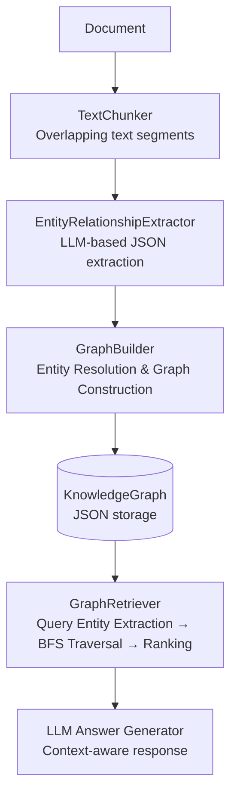
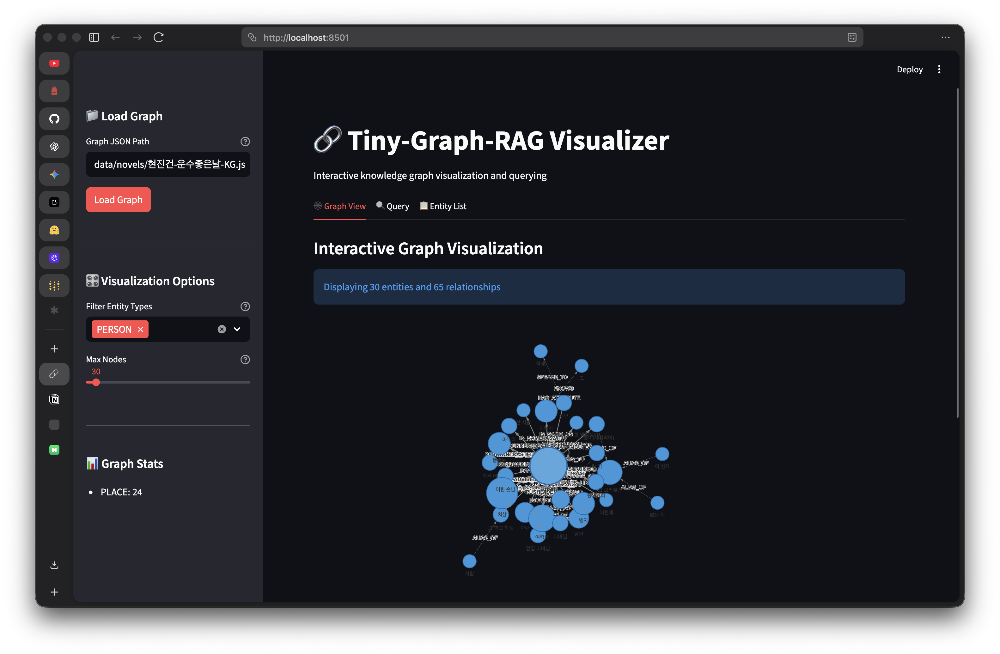
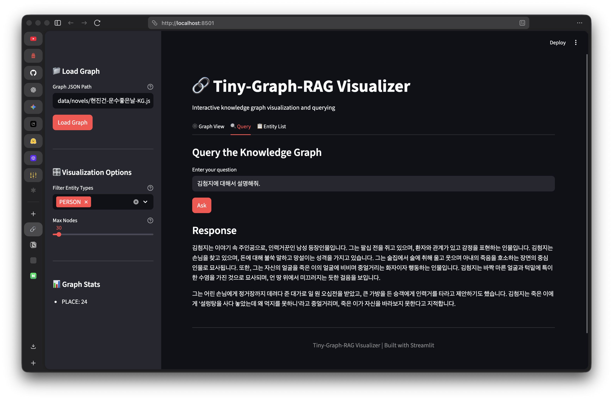

# Tiny-Graph-RAG

A lightweight Graph RAG framework that builds knowledge graphs from text using the OpenAI API and constructs QA context through graph traversal.

Instead of vector DB-based semantic search, it leverages explicit entity connections (BFS traversal + heuristic ranking) for transparent knowledge extraction and reasoning.

---

## Features

| Feature | Description |
| :--- | :--- |
| **Lightweight Storage** | Manages knowledge graphs as plain JSON files — no graph DB required |
| **LLM-Powered Extraction** | Extracts entities, types, descriptions, and relationships from unstructured text via LLM |
| **Advanced Retrieval** | Combines BFS subgraph expansion with heuristic ranking to capture relevant context |
| **Entity Resolution** | Deduplicates entities (aliases, typos, etc.) using LLM-based merge logic |
| **Evaluation Pipeline** | Measures retrieval quality with Precision, Recall, MRR, nDCG, and more |
| **Visualization** | Renders the knowledge graph as an interactive HTML using Pyvis |

---

## Architecture



For detailed module descriptions, see [docs/README.md](docs/README.md)

- [Chunking Guide](docs/chunking.md)
- [Entity Resolution Guide](docs/entity-resolution.md)

---

## Getting Started

**Requirements:** Python 3.13+, OpenAI API Key

```bash
uv sync
export OPENAI_API_KEY="your-api-key"
```

> Default model settings and chunking parameters are managed in `config.yaml`.

---

## CLI Usage

### 1. Build a Graph

```bash
uv run python main.py process "data/novels/kim-camellia.txt" -o "kim-camellia-KG.json"
```

### 2. Query

```bash
uv run python main.py query "Explain the relationship between Jeom-soon and the rooster." -g "kim-camellia-KG.json"
```

### 3. Stats

```bash
uv run python main.py stats -g "kim-camellia-KG.json"
```

### 4. Streamlit Web UI

```bash
uv run python main.py app
```

| Graph View | Query View |
| :---: | :---: |
|  |  |

---

## Evaluation

Quantitatively measures retrieval quality. The output JSON includes per-example metrics and an overall summary (latency, token usage, estimated cost).

```bash
uv run python main.py eval \
  --dataset "kim-camellia-eval.jsonl" \
  -g "kim-camellia-KG.json" \
  -o "kim-camellia-eval-results.json"
```

For detailed options and dataset format, see [docs/evaluation.md](docs/evaluation.md).

### Benchmark Results (Top-K=5, Hops=2–4)

| Dataset | Type | Recall@5 | MRR | nDCG@5 |
| :--- | :--- | :---: | :---: | :---: |
| Kim Yujeong — Camellia | Standard | 1.00 | 0.95 | 0.96 |
| Kim Yujeong — Camellia | Hardset | 0.87 | 0.79 | 0.81 |
| Hyun Jingeon — A Lucky Day | Standard | 1.00 | 0.95 | 0.97 |
| Yi Sang — Wings | Standard | 1.00 | 0.96 | 0.98 |

> Hardset includes multi-hop queries and character alias noise, making it harder than the standard set.

---

## Testing

```bash
uv run pytest
```

---

## Data Structure

```
data/
├── novels/   # Source texts (<title>.txt)
├── eval/     # Evaluation sets (<title>-eval.jsonl, <title>-hardset.jsonl)
├── kg/       # Generated graphs (<title>-KG.json)
└── results/  # Evaluation results (<title>-eval-results.json)
```

The CLI automatically resolves relative paths against each default folder.
Override with `--kg-dir`, `--dataset-dir`, `--results-dir` options or the environment variables `KG_DIR`, `DATASET_DIR`, `RESULTS_DIR`.

---

## License

MIT
